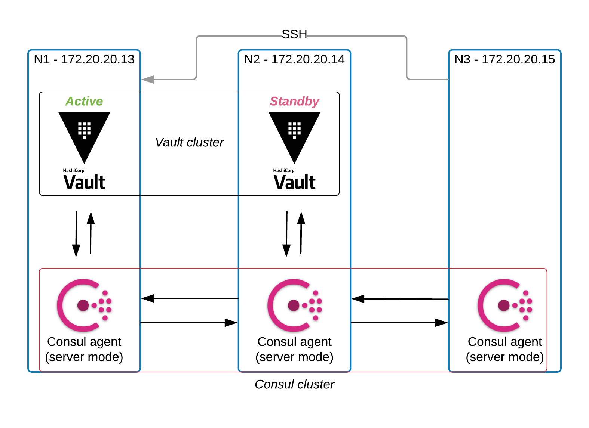

# Vault SSH CA HA

This demo will setup a local HA Vault cluster with Consul cluster storage backend. This diagram below lays out the architecture for reference:



## Vault and Consul Cluster setup:
```
n1: 172.20.20.13
n2: 172.20.20.14
n3: 172.20.20.14
```

## Vault setup with Consul:
Provision the Vault servers using vagrant: `vagrant up`

### Start consul and vault on node 1:
Issue `vagrant ssh n1` and run the commands below to start the vault server and initialize it.
```
export VAULT_ADDR="http://127.0.0.1:8200"
vault operator init -format=json -n 1 -t 1 > /vagrant/vault.txt
cat /vagrant/vault.txt | jq -r '.unseal_keys_b64[0]' > /vagrant/unseal_key
cat /vagrant/vault.txt |jq -r .root_token > /vagrant/root_token
export VAULT_TOKEN=$(cat /vagrant/root_token)
vault operator unseal $(cat /vagrant/unseal_key)
vault token lookup
```

In a new terminal, unseal and login to the vault server on node 1:
```
vagrant ssh n1
vault operator unseal
vault login
vault status
```

### Start consul and vault on node 2:
In a new terminal, issue `vagrant ssh n2` and run the commands below.
```
vault operator unseal $(cat /vagrant/unseal_key)
vault token lookup
vault status
```

## Client Key Signing

### SSH Host Setup for Client signing
In this example we are using `n1` as the SSH host. Continue to vault setup:
- Enable the SSH secrets engine and mount it in an arbitrary path. This path will be used to sign Client SSH keys.
- Generate new keys in that path. You can also import keys from your existing PKI, or a Vault PKI engine.
- Create the trusted user CA Keys and update SSH server.

```
vault secrets enable -path=ssh-client-signer ssh
vault write ssh-client-signer/config/ca generate_signing_key=true
vault read -field=public_key ssh-client-signer/config/ca > trusted-user-ca-keys.pem
sudo cp trusted-user-ca-keys.pem /etc/ssh/
echo "TrustedUserCAKeys /etc/ssh/trusted-user-ca-keys.pem" | sudo tee -a /etc/ssh/sshd_config
sudo service sshd restart
```
Add policies to Vault to allow SSH Certificates to be signed. Add restrictions here if applicable.
- Add 2 roles to Vault:
  - Allow client to sign their public key using vault. Adjust TTL, allowed users here if needed.
  - Allow client to access paths at Vault server endpoint.
- Also 2 new users using user and password authentication method. The actual authentication can be sourced from an existing identity source such as LDAP, Git etc.

```
vault write ssh-client-signer/roles/clientrole @/vagrant/signer-clientrole.json
vault policy write user /vagrant/user-policy.hcl
vault auth enable userpass
vault write auth/userpass/users/vagrant password=test policies=user
vault write auth/userpass/users/kawsar password=test policies=user
```

At this point we have the minimum setup needed to SSH-CA based workflow. However, to alleviate the Host Key verification prompt, lets use Host key signing.

### SSH Host Setup for Host key signing
Perform these steps from `n1` to alleviate the `Host key verification failed.` message.
- Mount the SSH secrets engine in another path. This path will be used to sign Host SSH keys.
- Write a policy for the server and adjust parameters as needed. The server certificate is generally expected to be a long lived one.
- Sign the Host SSH public keys and instruct OpenSSH to use it.

```
vault secrets enable -path=ssh-host-signer ssh
vault write ssh-host-signer/config/ca generate_signing_key=true
vault secrets tune -max-lease-ttl=87600h ssh-host-signer
vault write ssh-host-signer/roles/hostrole \
    key_type=ca \
    ttl=87600h \
    allow_host_certificates=true \
    allowed_domains="localdomain,example.com" \
    allow_subdomains=true

vault write -field=signed_key ssh-host-signer/sign/hostrole \
    cert_type=host \
    public_key=@/etc/ssh/ssh_host_rsa_key.pub > ssh_host_rsa_key-cert.pub

sudo cp ssh_host_rsa_key-cert.pub /etc/ssh/
sudo chmod 0640 /etc/ssh/ssh_host_rsa_key-cert.pub

sudo echo "HostKey /etc/ssh/ssh_host_rsa_key" | sudo tee -a /etc/ssh/sshd_config
sudo echo "HostCertificate /etc/ssh/ssh_host_rsa_key-cert.pub" | sudo tee -a /etc/ssh/sshd_config
sudo service sshd restart

echo "@cert-authority *.example.com" $(vault read -field=public_key ssh-host-signer/config/ca) | tee -a .ssh/known_hosts
```

### SSH Client Setup
The user will now sign his or her key with vault ca. SSH into the client server (`vagrant ssh n3`) and run the following commands.
- Clear out any previous certificates
- Generate a new pair of RSA keys
- Sign the public key using vault's client signer endpoint that we mounted before.

```
cd && rm -f .ssh/id_rsa && rm -f .ssh/id_rsa-cert.pub
ssh-keygen -t rsa -N "" -C "$(whoami)@hashicorp.com" -f .ssh/id_rsa
vault login -method=userpass username=$(whoami) password=test
vault write -field=signed_key ssh-client-signer/sign/clientrole \
  valid_principals=$(whoami) \
  public_key=@.ssh/id_rsa.pub > .ssh/id_rsa-cert.pub
chmod 0400 /home/$(whoami)/.ssh/id_rsa-cert.pub
```
Try to ssh to `ssh n1.example.com`. Attempt to ssh should prompt for the Host key verification. Mention `no` here and add the public_key of SSH host signer to known_hosts file.
```
echo "@cert-authority *.example.com" $(vault read -field=public_key ssh-host-signer/config/ca) | tee -a .ssh/known_hosts
```
Attempt ssh again: `ssh n1.example.com`.

### Add a new user:
Add a new user using the `adduser` command in both host and client: `sudo adduser kawsar`. Now proceed with the steps below in the client machine.
```
su kawsar
cd
mkdir .ssh && touch .ssh/authorized_keys
```

### Time limited key (pending implementation:
- These commands are implemented in curl
- Create a paylod to send to Vault REST API:
```
cd && rm -f .ssh/id_rsa && rm -f .ssh/id_rsa-cert.pub
ssh-keygen -t rsa -N "" -C "$(whoami)@hashicorp.com" -f .ssh/id_rsa
vault login -method=userpass username=$(whoami) password=test
echo '{
    "public_key": "$(cat .ssh/id_rsa.pub)",
    "valid_principals": "$(whoami)",
    "ttl": "2m"
}' > ssh-ca-11.json
```
- Run the command:
```
curl -s \
  --header "X-Vault-Token: $VAULT_SSHCA_TOKEN" \
  --request POST \
  --data @ssh-ca-11.json \
  $VAULT_ADDR/v1/ssh-client-signer/sign/clientrole | python -mjson.tool > ssh-ca-11.out
```
- To extract the signed certificate:
```
cat ssh-ca-11.out | jq -r .data.signed_key > id_rsa-cert.pub
chmod 0400 /home/$(whoami)/.ssh/id_rsa-cert.pub
echo "@cert-authority *.example.com" $(vault read -field=public_key ssh-host-signer/config/ca) | tee -a .ssh/known_hosts
```
- Attempt ssh again: `ssh n1.example.com`.
